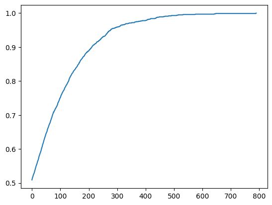
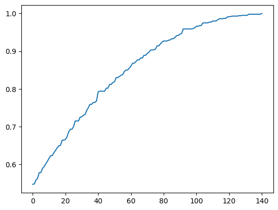
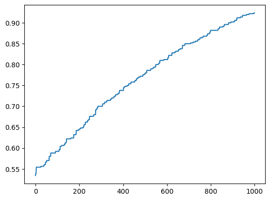

**Author**: Alessandro Chiabodo
 - Student ID: `s309234`
 - Institutional Email: `s309234@studenti.polito.it`
 - Repository : [AChiabodo/compIntelligence](https://github.com/AChiabodo/compIntelligence.git)

Resources Used:
 - [squillero/computational-intelligence](https://github.com/squillero/computational-intelligence) : Main source of material for the lab requirements and code
 - Agoston E Eiben, J. E. Smith, *Introduction to Evolutionary Computing* [2nd edition] : Main source for ES algorithms and representations
 - Stuart Russel, Peter Norvig, *Artificial Intelligence: A Modern Approach* [4th edition] : Partial source for ES algorithms and theory
 - [ChatGPT](https://chat.openai.com) : Used to optimize methods and generate documentation

# Lab9 - Black-Box Optimization
The main task is to write a local-search algorithm (eg. an EA) able to solve the *Problem* instances 1, 2, 5, and 10 on a 1000-loci genomes. We're not allowed to use any information about the problem, except for the fitness function.

## Step 1: Define the Interface for the Agents
First of all I've defined the Agent interface, that is the main interface for interoperability between different agents classes, and contains the main methods needed to train and use the agent.

## Step 2: Define basic Agent and local search
The first agent defined (AgentGA) is a basic implementation of a 1000-loci genome with binary representation and simple mutation and crossover operators.
A first implementation of a local search algorithm is also defined, based on the idea of a "hill-climbing" algorithm, that is a simple algorithm that iteratively moves from a solution to a better one, until a local optimum is reached. Is possible to see that it's able to find a good solution with few calls to the fitness function but only for the 1st problem instance

## Step 3: More complex EA and local search
To improve the results obtained with hill-climbing is possible to use Evolutionary Algorithms, that are able to explore the search space more efficiently. With the class AgentIslandsTraining there are various implementations of EAs, for example Evolutionary Algorithms and Genetic Programming, that are able to find a good solution for almost all problem instances.

## Step 4: More complex Agents
To improve the results (but also to minimize the number of calls to the fitness function) is possible to use more complex agents, for example with a pattern-based representation where the 1000 loci-genome is now generated by the repetition of a pattern of N loci. This representation is able to find a good solution for all problem instances with a small number of calls to the fitness function.

## Step 5: More complex local search
To optimize the local search algorithm is possible to use an "Island-based" approach, where the search space is divided into sub-spaces and each sub-space is explored by a different agent. At each epoch (10 generations) some agents travels from one island to another. This approach is able to avoid early convergence to a local optimum.  
Another approach is to "save" the fitness associated with a specific genome, so that if the same genome is generated again it's not necessary to call the fitness function again. This approach is able to reduce the number of calls to the fitness function.  
A last optimization is to use a "random restart" approach, where the search is restarted from a random genome if the fitness doesn't improve for a certain number of generations. This approach is able to avoid small "mesa" of static fitness.